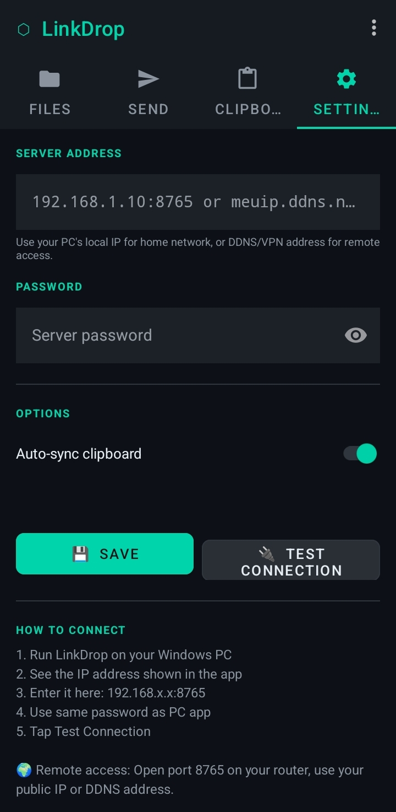

# LinkDrop

This is a software created to transfer files between Android and Windows using Internet. You can set-up for remote acces (different networks) as well.
Android/Mobile code.

# Features
- Save settings and Test connection
- Upload and download files
- Sync clipboard from both Android and Windows automatically
- Password option for security reasons
- IP, DDNS, VPN and Port configurations
- Notifications
- Activity logs
- Downloaded files will be saved on Downloads folder

# Support
Tested on Android 15 and 16

